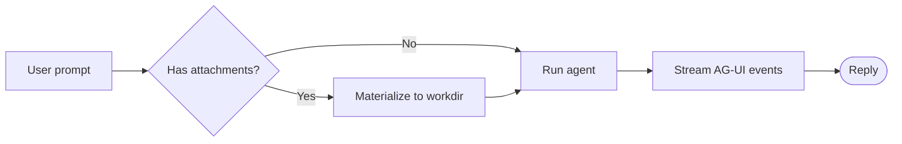

# Sample Document Demonstrating Full Markdown Features


## Overview

**Markdown** is created by [John Gruber](http://daringfireball.net/), the original guideline is [here](http://daringfireball.net/projects/markdown/syntax). Its syntax, however, varies between different parsers or editors. **This Render** is using [GitHub Flavored Markdown][GFM].

In addition to standard Markdown documentation, this document highlights or supplements the following capabilities.

## 1. Tables

Input `| First Header  | Second Header |` and press the `return` key. This will create a table with two columns.

After a table is created, putting focus on that table will open up a toolbar for the table where you can resize, align, or delete the table. You can also use the context menu to copy and add/delete individual columns/rows.


In markdown source code, they look like:

| First Header | Second Header |
| ------------ | ------------- |
| Content Cell | Content Cell  |
| Content Cell | Content Cell  |

You can also include inline Markdown such as links, bold, italics, or strikethrough in the table.

Finally, by including colons (`:`) within the header row, you can define text in that column to be left-aligned, right-aligned, or center-aligned:

| Left-Aligned  | Center Aligned  | Right Aligned |
| :------------ |:---------------:| -----:|
| col 3 is      | some wordy text | $1600 |
| col 2 is      | centered        |   $12 |
| zebra stripes | are neat        |    $1 |

## 2. Code Blocks


Supports fences in GitHub Flavored Markdown. Original code blocks in markdown are not supported.

Using fences is easy: Input \`\`\` and press `return`. Add an optional language identifier after \`\`\` and we'll run it through syntax highlighting:

````gfm
Here's an example:

```js
function test() {
  console.log("notice the blank line before this function?");
}
```

syntax highlighting:
```ruby
require 'redcarpet'
markdown = Redcarpet.new("Hello World!")
puts markdown.to_html
```
````

## 3. Diagrams (Mermaid)

It renders  [mermaid](https://mermaid.js.org/intro/) diagrams from a fenced code
block tagged `mermaid`. The block shows a **Render / Code** toggle so you can
flip between the rendered diagram and its source.

A flowchart:



## 4. Charts (Vega-Lite)

It renders [Vega-Lite](https://vega.github.io/vega-lite/) charts from a
fenced code block tagged `vega-lite` whose body is a Vega-Lite JSON spec. Like
Mermaid, it offers a **Render / Code** toggle.

A bar chart:

```vega-lite
{
  "$schema": "https://vega.github.io/schema/vega-lite/v5.json",
  "description": "A simple bar chart.",
  "data": {
    "values": [
      {"category": "Skills", "count": 12},
      {"category": "Documents", "count": 7},
      {"category": "Knowledge", "count": 5},
      {"category": "Agents", "count": 9}
    ]
  },
  "mark": "bar",
  "encoding": {
    "x": {"field": "category", "type": "nominal", "axis": {"labelAngle": 0}},
    "y": {"field": "count", "type": "quantitative"}
  }
}
```

## 5. Image and other media syntax

The renderer supports both standard Markdown and Obsidian-style embedded media syntax. Files can be referenced using standard Markdown image syntax, such as ``, or Obsidian's embed syntax, such as `![[path/to/image.jpg]]`. Based on the referenced file extension (e.g., `.jpg`, `.png`, `.gif`, `.pdf`, `.mp4`, `.mp3`, `.zip`, etc.), the frontend automatically renders the appropriate viewer or preview, including images, videos, audio players, PDF viewers, or downloadable file attachments, Common Examples:

|Content Type|Standard Markdown|Obsidian Embed|
|---|---|---|
|Image|``|`![[image.png]]`|
|PDF|`[PDF](docs/manual.pdf)`|`![[manual.pdf]]`|
|Video|`[Video](media/demo.mp4)`|`![[demo.mp4]]`|
|Audio|`[Audio](media/music.mp3)`|`![[music.mp3]]`|
|Other Files|`[File](files/archive.zip)`|`![[archive.zip]]` _(creates an embedded attachment or preview when supported)_|

Here are some tests：

![[attachments/image.svg]]


![[attachments/video.mp4]]


![[attachments/archive.zip]]

## 6. Footnotes

You can create footnotes like this[^footnote].

[^footnote]: Here is the *text* of the **footnote**.